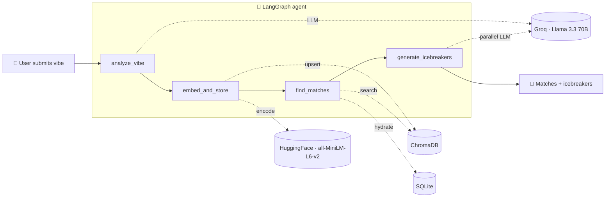

<div align="center">

# 🎨 VibeRoom

**AI-powered social matching, in plain English.**

Describe your current vibe. A 4-node LangGraph agent analyzes it, embeds it, finds people on the same wavelength, and writes personalized icebreakers, all in under 3 seconds.

[](https://viberoom-alpha.vercel.app)
[](https://viberoom-api.fly.dev/docs)
[](LICENSE)

[**Live demo**](https://viberoom-alpha.vercel.app) · [**API docs**](https://viberoom-api.fly.dev/docs) · [Architecture](#architecture) · [Engineering decisions](#notable-engineering-decisions)

</div>

---

## Demo

> Drop a screenshot or 15-second GIF here, e.g.:
> ``

| Landing | Create profile | Matches |
|---|---|---|
|  |  |  |

## Why this exists

Most matchmaking is filters. Age, distance, school, height. None of those tell you whether you'd actually enjoy a 30-minute conversation.

VibeRoom matches on *vibe*. You write a paragraph about how you feel right now, what you're into, what you'd talk about. The system finds the people closest to that energy and hands you opener questions that reference your overlap.

Built in a day. Free to run at this scale. Designed to demonstrate end-to-end AI/ML engineering, agent orchestration, vector search, RESTful API design, and modern frontend craft.

## Architecture



The 4 nodes:

1. **`analyze_vibe`** — Llama 3.3 70B extracts mood, energy level (1-10), key themes, and a one-line summary. Strict JSON output mode prevents drift.
2. **`embed_and_store`** — Concatenate vibe + interests + extracted themes, encode with sentence-transformers (384-dim), upsert into ChromaDB.
3. **`find_matches`** — Cosine semantic search over the collection, hydrate each hit from SQLite for full profile data.
4. **`generate_icebreakers`** — For each match, generate 2 personalized opener questions referencing shared interests. Calls fan out via `asyncio.gather` so total latency is bounded by the slowest match LLM call, not their sum.

## Tech stack

| Layer | Choice | Why |
|---|---|---|
| **Frontend** | React 19 · Vite · TypeScript · Tailwind v4 · React Router · Bun | Modern, type-safe, fast HMR, Bun is 10× faster than npm |
| **Backend** | Python 3.12 · FastAPI · uv · SQLAlchemy · Pydantic v2 | uv is 10-100× faster than pip, Pydantic v2 gives strict runtime validation, FastAPI auto-generates OpenAPI |
| **AI/ML** | LangGraph · LangChain · Groq · Llama 3.3 70B · sentence-transformers | LangGraph makes nodes independently swappable and testable; Groq's LPU is the fastest LLM inference available; local embeddings = free + no data leaves the box |
| **Storage** | SQLite (relational) · ChromaDB (vector) | Single-node, zero ops for the demo. ChromaDB persists to disk, SQLite to a Fly volume |
| **Infra** | Docker · Docker Compose · Fly.io · Vercel · nginx | Multi-stage builds, free-tier deploys, persistent volumes for SQLite + Chroma + HuggingFace cache |

## Notable engineering decisions

The interesting tradeoffs, not the resume bullet points.

### 1. LangGraph over chained LLM calls

Could have written `analyze() → embed() → search() → icebreakers()` as four function calls. Picked LangGraph because:
- Each node is independently testable. Swap `analyze_vibe` for a smaller model without touching the others.
- Adding a moderation node before `embed_and_store` is a 1-line graph edit, not a rewrite.
- TypedDict shared state means Python type-checks the contract between nodes.
- The graph compiles to a Mermaid diagram via `agent_graph.get_graph().draw_mermaid_png()` — same one rendered above.

### 2. `asyncio.gather` for icebreakers

`generate_icebreakers` runs N LLM calls (one per match). Sequential = N × ~500ms = bad. Parallel via `asyncio.gather` = bounded by the slowest single call. For 3 matches, total latency dropped from ~1.5s to ~600ms.

### 3. Strict JSON mode + safe-fallback wrapper

Groq supports `response_format={"type": "json_object"}`. Setting that eliminated 90% of LLM JSON drift.

But LLMs still return out-of-range values occasionally (`energy_level: 15` when asked for 1-10). Pydantic now enforces `Field(ge=1, le=10)` — but a strict validator means a malformed output 500s the request. So I wrapped it: `_safe_vibe_analysis(data)` validates strictly, falls back to defaults on `ValidationError`. The user always gets *something*, never an error page.

### 4. Groq + Llama 3.3 70B over OpenAI

OpenAI gives you 2-4s per call on GPT-4-class models. Groq gives sub-second on equivalent-quality Llama 3.3 70B for free, because they run on custom LPU hardware. For a real-time UX in a social app, latency is the product. Plus: no credit card required.

### 5. Local sentence-transformers over OpenAI embeddings

`all-MiniLM-L6-v2` is 384-dim, runs on CPU, free, and never sends user data to a third party. For 8 to 8000 users, plenty. At 8M users I'd reconsider. Concrete tradeoff: ~80MB cold start vs ~$0.02/1k embeddings forever — for the demo, free wins.

### 6. SQLite + Fly volume, not Postgres

Single-node, zero ops, ACID. Total storage cost: ~$0.15/mo. The migration path to Postgres + pgvector is well-trodden if I outgrow it. For now, SQLite handles thousands of writes/sec on a single box and lets me iterate without a managed-DB layer.

### 7. CORS from env, not hardcoded

`CORS_ORIGINS=https://viberoom-alpha.vercel.app` flows in via Fly secrets. Local dev defaults to `http://localhost:5173`. No code change between local and prod, just a different env var.

### 8. Pre-download cache on persistent volume

The HuggingFace embedding model is ~80MB. Downloading it on container start = 30s cold start every redeploy. Solution: set `HF_HOME=/app/data/.cache/huggingface` so it lives on the persistent volume. First request after a fresh deploy downloads it once; subsequent requests + future deploys read it instantly.

## Try it locally in 60 seconds

```bash
git clone https://github.com/pruthvigunturu/viberoom.git
cd viberoom
echo "GROQ_API_KEY=gsk_your_key_here" > backend/.env  # get one free at console.groq.com
docker compose up --build
```

Open http://localhost:5173. To get instant believable matches, seed the demo data:
```bash
cd backend && uv run python scripts/seed.py
```

Or run dev servers without Docker:
```bash
# terminal 1 — backend
cd backend && uv sync && uv run uvicorn app.main:app --reload

# terminal 2 — frontend
cd frontend && bun install && bun run dev
```

## Deploy your own (free tier)

- **Frontend** → Vercel: import this repo, set root to `frontend`, add `VITE_API_URL` env var pointing to your backend
- **Backend** → Fly.io: `cd backend && fly launch && fly volumes create viberoom_data --size 1 && fly secrets set GROQ_API_KEY=... CORS_ORIGINS=https://your.vercel.app && fly deploy`
- **Total cost** ≈ $3-5/mo (Vercel free, Fly $3-5, Groq free, GitHub free)

## API reference

Interactive OpenAPI docs at [`/docs`](https://viberoom-api.fly.dev/docs).

| Method | Path | Purpose |
|---|---|---|
| `GET` | `/health` | Liveness check |
| `POST` | `/users` | Create user, run full agent pipeline, return matches + icebreakers |
| `GET` | `/users` | List all users |
| `GET` | `/users/{id}` | Get one user |
| `GET` | `/users/{id}/matches` | Re-match an existing user (skips analyze + embed; reuses stored vector) |
| `GET` | `/users/{id}/agent-trace` | Return the saved vibe-analysis JSON |

## What I'd build next

In rough priority:

- **Auth (Clerk)** — anyone can hit `/users/{id}/matches` right now. Phase 2.
- **Real chat between matches** — Stream Chat or WebSocket rooms. Without this, the loop ends at "here are some openers" and users won't return.
- **Moderation node** — Llama Guard via Groq before `embed_and_store`. Reject NSFW, harassment, prompt injection. Required for a public social product.
- **Postgres + pgvector** — collapse SQLite + ChromaDB into one store, get HNSW indexes, multi-region replication.
- **Background embedding pipeline** — push the embed step to a Celery/RQ worker. POST `/users` returns immediately with the analysis; matches stream in via SSE or WebSocket.
- **LangSmith tracing** — per-node latency, prompt/response logs, A/B comparisons across graph versions.
- **Rate limiting** — `slowapi` per-IP cap to prevent Groq quota burn.

## Engineering process

- **Build guide first.** [`VibeRoom_Build_Guide.md`](VibeRoom_Build_Guide.md) is the original 12-step plan I worked from. Ships and reads like a runbook.
- **Pre-landing review.** Before merging anything, ran a structured code review pass that caught a critical Docker volume bug (single-file mount that would have broken every fresh clone), 4 mechanical fixes (deprecated FastAPI hook, unbounded Pydantic field, dead code, mid-file imports), and 4 informational items deferred to "future work."
- **Iterative deploy.** Three real bugs found during deploy that the local dev server missed: Fly remote builder timeout (fixed by removing model pre-download from Dockerfile, persisting cache to volume instead), Python urllib SSL cert verify on macOS (fixed with explicit certifi context), CORS env var parsing (refactored Settings to accept comma-separated string).

## License

[MIT](LICENSE) · Built for [Tweeny](https://tweeny.com) · 2026
