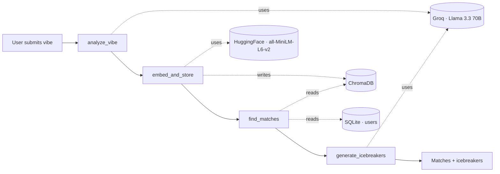

# VibeRoom

**AI-powered social engagement platform — describe your vibe, get matched with people, get personalized icebreakers.**

A user describes their current vibe in plain English. A LangGraph agent then runs a 4-step pipeline — analyzes the vibe, embeds it, semantically matches them with similar users, and generates personalized icebreakers in parallel. Frontend in React + Bun, backend in Python + FastAPI, agent orchestrated with LangGraph, embeddings via HuggingFace, inference via Groq's Llama 3.3, vector search in ChromaDB, packaged in Docker.

---

## Architecture



The 4-node LangGraph pipeline (also rendered as `docs/agent_flow.png`):

1. **analyze_vibe** — LLM extracts mood, energy level, key themes, and a one-line summary. Strict JSON via Groq's response-format mode.
2. **embed_and_store** — concatenates vibe + interests + themes, encodes with sentence-transformers (384-dim), upserts into ChromaDB.
3. **find_matches** — semantic search over the collection, hydrates each hit from SQLite.
4. **generate_icebreakers** — for each match, the LLM writes 2 personalized icebreakers. Calls fan out via `asyncio.gather` so latency is bounded by the slowest match, not their sum.

---

## Tech stack

| Layer       | Tool                                    |
|-------------|-----------------------------------------|
| Frontend    | Bun · Vite · React 19 · TypeScript · Tailwind v4 · React Router · lucide |
| Backend     | uv · FastAPI · SQLAlchemy · Pydantic    |
| AI / ML     | LangChain · LangGraph · Groq (Llama 3.3 70B) · sentence-transformers · ChromaDB |
| Storage     | SQLite (relational) · ChromaDB (vector) |
| Infra       | Docker · Docker Compose · nginx         |

---

## Quick start

```bash
# 1. drop your Groq key into backend/.env
cp backend/.env.example backend/.env
# edit backend/.env and paste your gsk_... key

# 2. boot everything
docker compose up --build

# 3. seed 8 demo users (in another terminal)
cd backend && uv run python scripts/seed.py

# 4. open the app
open http://localhost:5173
```

> The first profile creation takes ~10–20s because sentence-transformers
> downloads its model on first use. Subsequent requests are sub-second.
> Always warm the model with one POST before the demo.

### Local dev (without Docker)

Backend:
```bash
cd backend
uv sync
uv run uvicorn app.main:app --reload
```

Frontend:
```bash
cd frontend
bun install
bun run dev
```

---

## Environment variables

| Var               | Default                                   | Notes                          |
|-------------------|-------------------------------------------|--------------------------------|
| `GROQ_API_KEY`    | —                                         | required, free tier at console.groq.com |
| `GROQ_MODEL`      | `llama-3.3-70b-versatile`                 | any Groq chat model            |
| `DATABASE_URL`    | `sqlite:///./viberoom.db`                 | swap for postgres in prod      |
| `CHROMA_PERSIST_DIR` | `./chroma_db`                          | host-mounted in compose        |
| `EMBEDDING_MODEL` | `sentence-transformers/all-MiniLM-L6-v2`  | 384-dim, CPU-friendly          |
| `VITE_API_URL`    | `http://localhost:8000`                   | frontend → backend, build-time |

---

## API reference

Interactive docs at `http://localhost:8000/docs`.

| Method | Path                        | Purpose                                                                 |
|--------|-----------------------------|-------------------------------------------------------------------------|
| GET    | `/health`                   | Liveness check                                                          |
| POST   | `/users`                    | Create user, run full agent pipeline, return matches + icebreakers      |
| GET    | `/users`                    | List all users                                                          |
| GET    | `/users/{user_id}`          | Get one user                                                            |
| GET    | `/users/{user_id}/matches`  | Re-match an existing user (skips analyze + embed; reuses stored vector) |
| GET    | `/users/{user_id}/agent-trace` | Return the stored vibe-analysis JSON for a user                      |

Example `POST /users` body:
```json
{
  "name": "Maya",
  "vibe_text": "Late-night coder, lo-fi at 2am, building weird side projects.",
  "interests": ["coding", "lo-fi", "ramen"]
}
```

Returns:
```json
{
  "user": { "id": "uuid", "name": "Maya", "vibe_text": "...", "interests": [...], "created_at": "..." },
  "vibe_analysis": { "mood": "focused", "energy_level": 8, "key_themes": [...], "summary": "..." },
  "matches": [
    {
      "user": { ... },
      "similarity_score": 0.42,
      "vibe_analysis": { ... },
      "icebreakers": ["...", "..."]
    }
  ]
}
```

---

## What I'd do next with more time

- **Postgres + pgvector** instead of SQLite + ChromaDB — one store, ACID, HNSW index, easier to operate.
- **LangSmith tracing** — per-node latency, prompt/response logs, A/B comparisons across graph versions.
- **Live rooms** — WebSocket-backed ephemeral chat between matched users so the app actually closes the loop.
- **Moderation node** — Llama Guard via Groq before `embed_and_store` so abusive vibes never enter the space.
- **Caching** — prompt-cache the analyze step per (vibe_text, interests) hash; embedding cache on identical text.
- **Background embeddings** — push the embed step to a Celery/RQ worker so the request returns as soon as analysis is done.
- **CI/CD** — GitHub Actions: typecheck + build + Docker push, deploy to Fly.io (backend) and Vercel (frontend).

---

Built for Tweeny. The whole thing runs on free tiers — Groq for inference, HuggingFace for embeddings, SQLite + ChromaDB for storage, Vercel + Fly.io for deploy. Total infra cost: ₹0.
